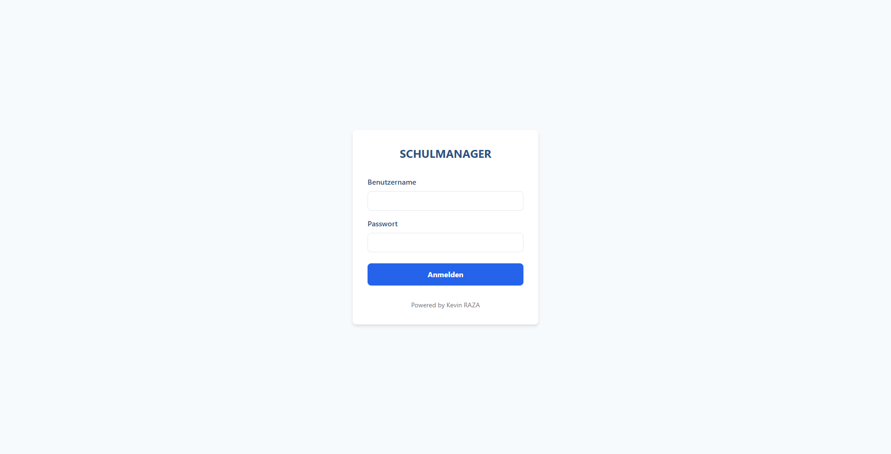
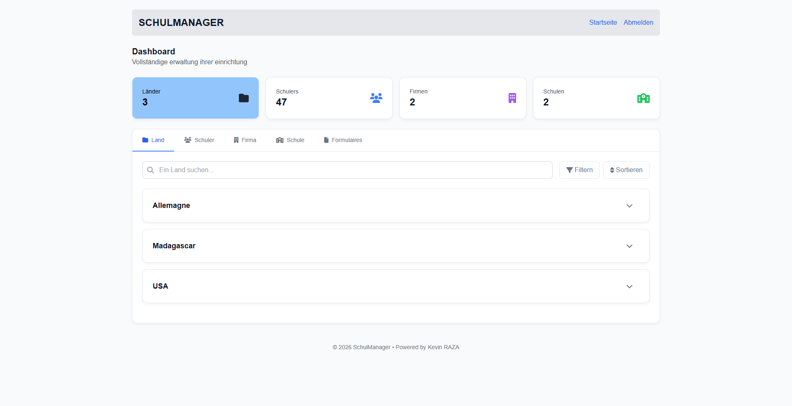
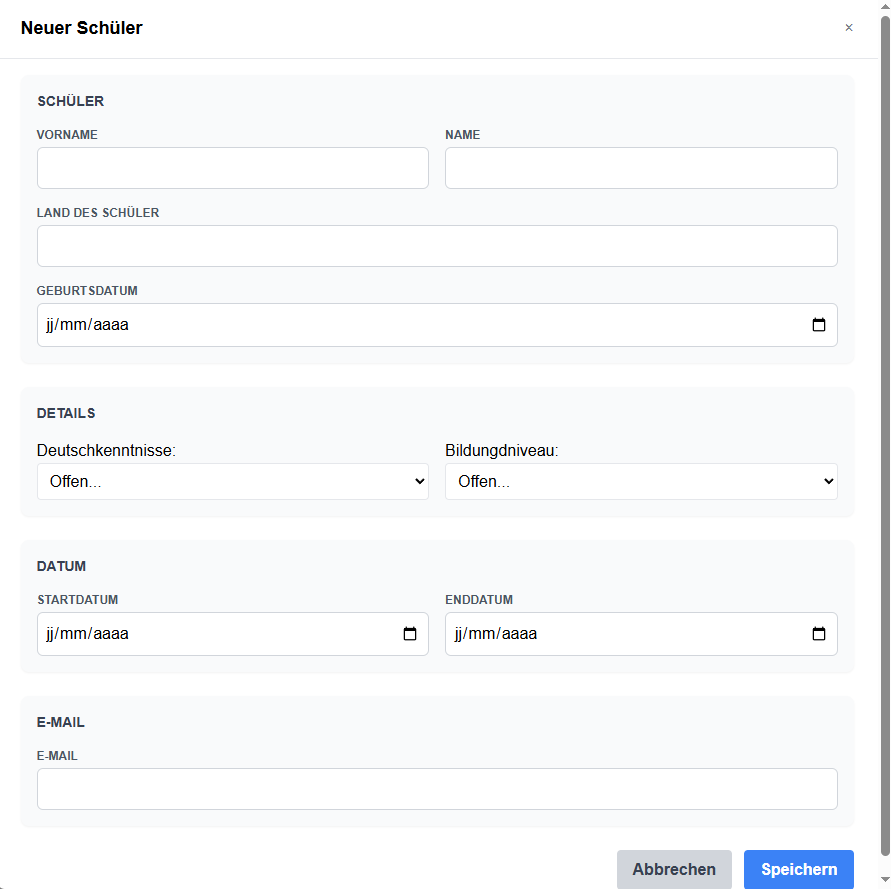

# 🎓 SCHULMANAGER


A modern german **School Management** built with **Laravel, Livewire, Alpine.js and Tailwind CSS**.  
This project focuses on managing schools with real-time search, sorting, pagination and a clean dashboard UI.

---

## 📸 Preview





---

## 📖 Description

This application allows users to manage **schools and their related information** in a single dashboard.

It was built as a **portfolio project** to demonstrate:
- Laravel backend architecture
- Livewire real-time components
- Clean UI with Tailwind CSS
- Dashboard-style data presentation

The project simulates a real-world internal management tool for institutions.

---

## 📑 Table of Contents

- [Features](#-features)
- [Tech Stack](#-tech-stack)
- [Demo](#-demo)
- [Quick Start](#-quick-start)
- [File Structure](#-file-structure)
- [Browser Support](#-browser-support)
- [License](#-license)
- [Author](#-author)

---

## ✨ Features

- 🔍 Search schools by:
  - School name
  - Country
  - School director
- ↕️ Sort data dynamically
- 📄 Pagination
- 🧩 Tab-based navigation
- ⚡ Livewire reactive components
- 🎨 Responsive UI
- 🔐 Ready for authentication extension

---

## 🛠 Tech Stack

### Backend
- Laravel 10
- PHP 8+

### Frontend
- Livewire 3
- Alpine.js
- Tailwind CSS

### Database
- MySQL

### Tools
- Git
- Composer
- NPM
- Font Awesome

---

## 🚀 Demo

> Demo version coming soon

You can run the project locally following the instructions below.

---

## ⚡ Quick Start

### 1️⃣ Clone the repository

```bash
git clone https://github.com/KevsRaza/Schulmanager.git
cd school-management-dashboard
